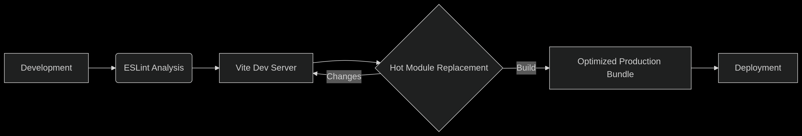
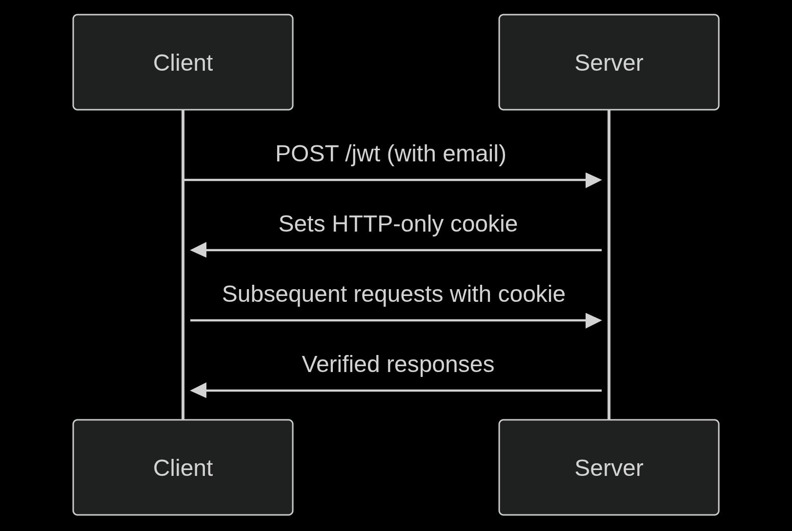

# Foodly <a href="https://github.com/TheMehediHQ/Foodly"></a>

A full-stack **food inventory management** application built as a **Bun workspace
monorepo** and orchestrated with **Turborepo**. It pairs an Express REST API
(with JWT authentication backed by MongoDB) with a React 19 + Vite + Tailwind
CSS frontend that authenticates through Firebase.

- **`apps/api`** — Express 5 REST API (JWT auth, MongoDB Atlas, httpOnly cookie session)
- **`apps/web`** — React 19 + Vite + Tailwind CSS frontend (Firebase Auth, React Router v7, Framer Motion)
- **`packages/eslint-config`** — shared ESLint flat config

> Powered by [Bun](https://bun.sh) (package manager + runtime) and
> [Turborepo](https://turbo.build) for incremental build caching and task
> orchestration.

---

## Table of contents

- [Features](#features)
- [Tech stack](#tech-stack)
- [Screenshots](#screenshots)
- [Architecture overview](#architecture-overview)
- [Prerequisites](#prerequisites)
- [Installation](#installation)
- [Environment variables](#environment-variables)
- [Database setup](#database-setup)
- [Development](#development)
- [Available scripts](#available-scripts)
- [Project structure](#project-structure)
- [API reference](#api-reference)
- [Authentication](#authentication)
- [Deployment](#deployment)
- [Testing](#testing)
- [Code quality](#code-quality)
- [Contributing](#contributing)
- [License](#license)
- [Code of Conduct](#code-of-conduct)
- [Security](#security)
- [Support](#support)

---

## Features

- **Food inventory CRUD** — create, read, update, and delete food items with an
  image, title, category, quantity, expiry date, and description.
- **Expiry tracking** — live countdown timers highlight items approaching or past
  their expiration date (powered by `react-countdown` and `date-fns`).
- **Notes** — authenticated users can attach notes to food items.
- **User ownership** — food items and notes are tagged with the creator's email;
  only the creator can edit their items or add notes.
- **Authentication** — email/password and Google sign-in via Firebase Auth on the
  client, backed by a JWT issued by the API.
- **Dashboard** — protected dashboard with an overview/stats view, listing of all
  foods, your foods, and your profile.
- **Dark mode** — a persistent dark/light theme toggle.
- **Responsive UI** — Tailwind CSS + DaisyUI, optimized with Framer Motion and
  Swiper carousels.
- **Monorepo tooling** — Turborepo caching, shared ESLint flat config, and
  Prettier formatting across the workspace.
- **Deployment-ready** — web ships to **Firebase Hosting**; API deploys to
  **Vercel** as a serverless function (or runs self-hosted with Bun).

---

## Tech stack

| Area | Technology |
| ---- | ---------- |
| Runtime / package manager | [Bun](https://bun.sh) `>=1.2` (lockfile: `bun.lock`) |
| Monorepo / build cache | [Turborepo](https://turbo.build) `^2.4` |
| Linting | ESLint 9 (flat config, shared `@foodly/eslint-config`) |
| Formatting | Prettier `^3.5` |
| **API** | Express 5, MongoDB driver 6, `jsonwebtoken`, `cookie-parser`, `cors`, `dotenv` |
| **Web** | React 19, Vite 6, Tailwind CSS 4, DaisyUI, React Router 7, Firebase 12 (Auth), Framer Motion, Swiper, Axios, date-fns, SweetAlert2, styled-components, lucide-react, react-icons |

> Node.js `>=18` is required (the API build step runs a `node --check`).

---

## Screenshots

The repository ships two screenshots that document the running app:

- API server diagram: `apps/api/server.png`
- Web client UI: `apps/web/client.png`




---

## Architecture overview

```
                     ┌──────────────────────┐
                     │   apps/web  (Vite)   │
                     │   React 19 + Firebase│
                     │   Auth, Tailwind     │
                     └──────────┬───────────┘
                                │  Axios (Bearer token)
                                ▼
┌────────────────────────────────────────────┐
│            API  (Express 5)                 │
│   verifyToken (JWT)  ──►  MongoDB Atlas      │
│   /jwt, /logout, /foods, /foods/notes/:id   │
└────────────────────────────────────────────┘
```

- The **web** app authenticates users with Firebase Auth (email/password and
  Google). On sign-in it calls `POST /jwt` to obtain a signed JWT that is stored
  in an **httpOnly** cookie, and the Axios client attaches the current user's
  token to subsequent API requests.
- The **API** verifies the JWT on protected routes using `JWT_SECRET`, then
  performs CRUD operations against a MongoDB Atlas collection (`foods`).
- On Vercel, `vercel.json` routes `/api/*` to the API function and serves the
  prebuilt web frontend; on Firebase, Hosting serves the `dist` output as a
  single-page app.

---

## Prerequisites

- **Bun** `>=1.2` — [install with](https://bun.sh/docs/install/unix)  
  `curl -LsSf https://bun.sh | bash` (or `brew install bun`, `nvm`-based, etc.)
- **Node.js** `>=18` (required by the API's build/lint step and dev engine)
- A **MongoDB Atlas** account and cluster (see [Database setup](#database-setup))
- A **Firebase** project with Authentication + a web app registered (see
  [Environment variables](#environment-variables))

---

## Installation

```bash
# 1. Clone the repository
git clone https://github.com/TheMehediHQ/Foodly.git
cd Foodly

# 2. Install all workspace dependencies (single lockfile at the repo root)
bun install

# 3. Configure environment variables (see next section)
# 4. Run the development servers
bun run dev
```

---

## Environment variables

Each app has its own `.env.example`. Copy them to `.env` and fill in real
values. **Never commit real `.env` files** — they are git-ignored.

```bash
cp apps/api/.env.example apps/api/.env
cp apps/web/.env.example apps/web/.env
```

### API (`apps/api/.env.example`)

| Variable | Required | Description |
| -------- | -------- | ---------- |
| `PORT` | No | Server port (default `5000`) |
| `NODE_ENV` | No | `development` / `production` |
| `DB_USER` | Yes | MongoDB Atlas username |
| `DB_PASS` | Yes | MongoDB Atlas password |
| `DB_NAME` | No | Database name (default `foodsdb`) |
| `DB_CLUSTER` | No | Atlas cluster host (default `cluster0.onrfrlh.mongodb.net`) |
| `JWT_SECRET` | Yes | Long random string used to sign JWTs |
| `FRONTEND_PROD_URL` | No | Production frontend URL (reference) |
| `FRONTEND_DEV_URL` | No | Development frontend URL (reference) |

> The connection string is built as
> `mongodb+srv://<DB_USER>:<DB_PASS>@<DB_CLUSTER>/?retryWrites=true&w=majority&appName=Cluster0`.
> `DB_USER`/`DB_PASS` may alternatively be supplied as `NAME`/`PASS` (the API
> falls back to those). On Vercel the platform sets `VERCEL=1` automatically so
> the server does not call `app.listen()`.

### Web (`apps/web/.env.example`)

| Variable | Required | Description |
| -------- | -------- | ---------- |
| `VITE_API_BASE_URL` | No | Backend base URL (default `/api` — proxied to the API in dev) |
| `VITE_FIREBASE_API_KEY` | Yes | Firebase web API key |
| `VITE_FIREBASE_AUTH_DOMAIN` | Yes | Firebase Auth domain |
| `VITE_FIREBASE_PROJECT_ID` | Yes | Firebase project ID |
| `VITE_FIREBASE_STORAGE_BUCKET` | Yes | Firebase storage bucket |
| `VITE_FIREBASE_MESSAGING_SENDER_ID` | Yes | Firebase messaging sender ID |
| `VITE_FIREBASE_APP_ID` | Yes | Firebase web app ID |
| `VITE_FIREBASE_MEASUREMENT_ID` | No | Firebase measurement ID (optional, analytics) |

> Vite exposes only environment variables prefixed with `VITE_` to the client
> bundle. The frontend reads its API base URL from `VITE_API_BASE_URL` and the
> Vite dev server proxies `/api` to `http://localhost:5000` during local
> development (see `apps/web/vite.config.js`).

---

## Database setup

Foodly uses **MongoDB Atlas** as its datastore — there is no SQL schema or
migration system. The API connects to a single `foods` collection inside the
configured `DB_NAME` database.

1. Create an account at [MongoDB Atlas](https://atlas.mongodb.com).
2. Create a cluster (or reuse an existing one) and a database user with
   read/write access.
3. Add your IP to the project's network access list (or allow access from
   anywhere while developing).
4. Whitelist the Vercel IP ranges once deployed to production.
5. Populate `apps/api/.env` with the Atlas credentials (`DB_USER`, `DB_PASS`,
   `DB_NAME`, `DB_CLUSTER`) and a strong `JWT_SECRET`.

The API lazily initializes its MongoDB connection on the first request, so no
manual migration step is required.

---

## Development

```bash
# Run both apps in parallel (API on 5000, web dev server on 5173)
bun run dev

# Or run a single app
bun run dev:web   # vite dev server → http://localhost:5173
bun run dev:api   # express (bun --watch) → http://localhost:5000
```

During local development the Vite dev server proxies `/api` to the API
(`http://localhost:5000`), so the `VITE_API_BASE_URL=/api` example works out of
the box.

---

## Available scripts

Root workspace (via Turborepo):

| Command | Description |
| ------- | ---------- |
| `bun run dev` | Start all dev servers (API + web, in parallel) |
| `bun run dev:web` | Start only the web dev server |
| `bun run dev:api` | Start only the API server |
| `bun run build` | Build all apps for production |
| `bun run build:web` | Build only the web app |
| `bun run lint` | Lint all apps |
| `bun run format` | Format the whole repo with Prettier |
| `bun run test` | Run the test suite across apps |
| `bun run clean` | Remove build artifacts from all apps |

App-level scripts:

| App | Command | Description |
| --- | ------- | ---------- |
| `apps/api` | `bun run dev` / `bun run start` / `bun run build` (`node --check`) / `bun run lint` / `bun run test` / `bun run clean` | |
| `apps/web` | `bun run dev` / `bun run build` / `bun run preview` / `bun run lint` / `bun run test` / `bun run format` | |

---

## Project structure

```
foodly/
├── package.json            # root workspace (packageManager: bun)
├── bun.lock                # single workspace lockfile
├── turbo.json              # Turborepo pipeline + env forwarding
├── vercel.json             # Vercel single-domain build/routes config
├── .prettierrc             # Prettier config
├── .prettierignore
├── .gitignore
├── README.md
├── LICENSE                 # MIT
├── CONTRIBUTING.md
├── CODE_OF_CONDUCT.md
├── SECURITY.md
├── .github/
│   ├── ISSUE_TEMPLATE/
│   │   ├── bug_report.md
│   │   └── feature_request.md
│   └── PULL_REQUEST_TEMPLATE.md
├── apps/
│   ├── api/                # Express 5 server (CommonJS)
│   │   ├── index.js        # single API entry point + all routes
│   │   ├── vercel.json     # @vercel/node build for the API
│   │   ├── .env.example
│   │   └── server.png
│   └── web/                # React 19 + Vite frontend (ESM)
│       ├── src/
│       │   ├── api/axios.js
│       │   ├── context/        # AuthProvider (Firebase), firebase config
│       │   ├── Components/
│       │   ├── layout/
│       │   ├── pages/
│       │   ├── routes/
│       │   ├── assets/
│       │   ├── App.jsx
│       │   └── main.jsx        # React Router v7 route tree
│       ├── public/
│       ├── firebase.json
│       ├── .firebaserc
│       ├── vite.config.js
│       ├── .env.example
│       └── client.png
└── packages/
    └── eslint-config/      # shared ESLint flat config (@foodly/eslint-config, MIT)
```

---

## API reference

Base path: `/api`. All routes are defined in the single file `apps/api/index.js`
and mounted at `app.use("/api", apiRouter)`.

| Method | Endpoint | Auth | Description |
| ------ | -------- | ---- | ----------- |
| `GET` | `/api` (via `/` root) | ❌ | Health check — `{ ok: true, message: "Server is running." }` |
| `POST` | `/api/jwt` | ❌ | Issue a signed JWT (2h) and set it as an httpOnly cookie |
| `POST` | `/api/logout` | ❌ | Clear the JWT cookie |
| `GET` | `/api/foods` | ❌ | List all food items |
| `GET` | `/api/foods/:id` | ❌ | Get a single food item by ID |
| `POST` | `/api/foods` | ✔️ | Create a food item (attaches `userEmail` + `addedAt` from the JWT) |
| `PUT` | `/api/foods/:id` | ✔️ | Update a food item by ID |
| `DELETE` | `/api/foods/:id` | ✔️ | Delete a food item by ID |
| `POST` | `/api/foods/notes/:id` | ✔️ | Append a note to a food item |

Responses use the envelope `{ ok: boolean, message?: string, data?: ... }`.
Protected routes require a valid `Authorization: Bearer <jwt>` header; requests
without a valid Bearer token receive `401 Unauthorized`.

---

## Authentication

- **Web (client):** Firebase Authentication — users can sign up / sign in with
  email & password, or via Google (`signInWithPopup`).
- **API (server):** a stateless JWT signed with `JWT_SECRET` (2-hour expiry). On
  sign-in the client calls `POST /api/jwt` with the user's email to obtain the
  token, which is stored in an httpOnly, SameSite cookie.
- The Axios client attaches the current Firebase user's token to requests, and a
  response interceptor signs the user out automatically on `401`.
- Security defaults on the API cookie: `httpOnly: true`, `secure` in production,
  and an origin allow-list via CORS.

---

## Deployment

### Web — Firebase Hosting

The web app is configured for [Firebase Hosting](https://firebase.google.com/docs/hosting)
(see `apps/web/firebase.json`; default project `food-garden-bd` in `.firebaserc`).

```bash
cd apps/web
bun run build
firebase deploy
```

### API — Vercel (recommended) or self-hosted

The API deploys to [Vercel](https://vercel.com) as a serverless function
(`apps/api/vercel.json` uses `@vercel/node`). The root `vercel.json` creates a
single-domain deployment: `/api/*` routes to the API function and everything else
serves the built web frontend from `dist/`.

To deploy the API alone to Vercel, link the `apps/api` directory and deploy.
Alternatively, run it anywhere Bun/Node:

```bash
cd apps/api
bun install
bun run start        # or: bun --watch index.js for development
```

Set the production environment variables (`DB_USER`, `DB_PASS`, `DB_NAME`,
`DB_CLUSTER`, `JWT_SECRET`, `NODE_ENV=production`, and the `FRONTEND_*_URL`
values) in the Vercel project settings.

> **Note:** the original repository referenced a Docker Compose deployment in an
> earlier README. That file is **not present** in this repository, so Docker
> deploy instructions are intentionally omitted. Contributions adding a
> `docker-compose.yml` are welcome — see [CONTRIBUTING.md](CONTRIBUTING.md).

---

## Testing

```bash
bun run test     # runs tests across the workspace via Turborepo
```

No test files are currently shipped; this script is wired through Turborepo and
runs each app's `test` script (`bun --test`). Add tests under each app as the
project grows.

---

## Code quality

```bash
bun run lint     # lint all apps (shared ESLint flat config)
bun run format   # format the whole repo with Prettier
```

The shared config lives in `packages/eslint-config` and is applied by each app's
`eslint.config.js` (Node/CommonJS for the API, browser/JSX for the web).

---

## Contributing

Contributions are welcome! Please read our
[contributing guide](CONTRIBUTING.md) and our [code of conduct](CODE_OF_CONDUCT.md)
to get started. In short:

1. Fork the repository.
2. Create a feature branch (`git checkout -b feat/your-feature`).
3. Make your changes and run `bun run lint` + `bun run format`.
4. Open a Pull Request and reference any related issues.

## License

This project is licensed under the terms of the **MIT License** — see
[LICENSE](LICENSE) for details.

## Code of Conduct

By participating in this project you agree to abide by the
[Contributor Covenant Code of Conduct](CODE_OF_CONDUCT.md).

## Security

If you believe you have found a security vulnerability, please read
[SECURITY.md](SECURITY.md) and report it responsibly. **Do not open a public
GitHub issue for security vulnerabilities.**

## Support

- File bugs and feature requests using the [GitHub issue templates](.github/ISSUE_TEMPLATE).
- For anything else, open a discussion or issue on
  [TheMehediHQ/Foodly](https://github.com/TheMehediHQ/Foodly).
